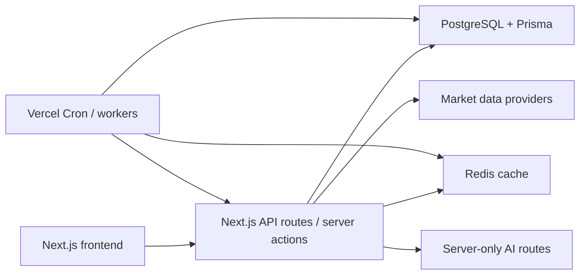

# StockLens Full-Stack Development Plan

StockLens frontend is already treated as the approved visual baseline. This plan turns the existing Git frontend into a production-ready full-stack application without redesigning the UI unless a page has a verified usability, accessibility, or responsive bug.

## 1. Guiding Principles

- **Frontend is the contract:** Existing routes, page layouts, component states, and sample data shapes define the first API contracts.
- **Backend first, redesign last:** Add real data, persistence, auth, and background jobs before changing visual direction.
- **Fallback-safe:** Every real API integration must keep sample-data fallback, loading state, empty state, and error state.
- **Vercel-safe:** Secrets stay server-side, production builds must pass, and preview deployments validate every major branch.
- **AI guarded:** Nex/OpenRouter remains a development harness unless production AI is explicitly enabled through server-only routes.

## 2. Approved Frontend Route Contract

| Route | Purpose | Backend Data Needed |
| --- | --- | --- |
| `/` | Market dashboard | indices, movers, sector heatmap, FII/DII flow, news, market status |
| `/stock/[ticker]` | Stock detail lens | quote, DVM, SWOT, history, financials, peers, analysts, forecasts, events, news |
| `/screener` | Stock discovery | screener fields, templates, filtered results, saved screeners |
| `/portfolio` | Portfolio management | portfolios, holdings, transactions, NAV history, realized/unrealized P&L |
| `/watchlist` | Watchlist tracking | watchlists, watchlist items, quote snapshots |
| `/alerts` | Alert engine | user alerts, alert triggers, delivery status, alert history |
| `/ipo` | IPO discovery | IPO calendar, subscription status, listing status, company summaries |
| `/login`, `/register` | Auth entry | auth provider, user profile bootstrap, demo mode |

## 3. Target Architecture



- Start with **Next.js API routes** for speed and Vercel simplicity.
- Add **PostgreSQL + Prisma** for users, portfolios, alerts, watchlists, and cached stock data.
- Add **Redis/Upstash** when caching, alert queues, or rate limits become necessary.
- Add a **Python/FastAPI worker** only if NSE/BSE scraping, yfinance, nselib, or heavy calculations outgrow Next.js routes.

## 4. API Contracts

Use the existing frontend sample data as the first schema source. API responses should be typed, stable, and versionable.

### Market Dashboard APIs

- `GET /api/market/overview`
  - Returns market status, indices, top movers, sector heatmap, FII/DII activity, and timestamp.
- `GET /api/market/news?sector=&ticker=&limit=`
  - Returns dashboard and stock-linked news cards.

### Stock Detail APIs

- `GET /api/stocks/search?q=`
  - Returns ticker, name, exchange, sector, and latest price summary.
- `GET /api/stocks/[ticker]`
  - Returns quote, stock info, DVM score, SWOT, history, financials, peers, analysts, forecasts, events, and news.
- `GET /api/stocks/[ticker]/history?range=1M|6M|1Y|5Y`
  - Returns OHLCV rows for charting.

### Screener APIs

- `GET /api/screener/fields`
  - Returns available screener fields, operators, labels, and units.
- `GET /api/screener/templates`
  - Returns expert strategy templates.
- `POST /api/screener/query`
  - Accepts filters and returns matching stocks with pagination and sorting.
- `GET /api/screeners`, `POST /api/screeners`, `PATCH /api/screeners/[id]`, `DELETE /api/screeners/[id]`
  - Manages saved user screeners.

### Portfolio APIs

- `GET /api/portfolios`
  - Returns portfolio list and selected portfolio summary.
- `POST /api/portfolios`
  - Creates a portfolio.
- `GET /api/portfolios/[id]`
  - Returns holdings, transactions, NAV history, and P&L.
- `POST /api/portfolios/[id]/transactions`
  - Adds buy, sell, dividend, bonus, or split transaction.
- `DELETE /api/portfolios/[id]/transactions/[transactionId]`
  - Removes a transaction and recalculates portfolio state.

### Watchlist + Alerts APIs

- `GET /api/watchlists`, `POST /api/watchlists`
  - Lists and creates watchlists.
- `POST /api/watchlists/[id]/items`, `DELETE /api/watchlists/[id]/items/[ticker]`
  - Adds/removes stocks.
- `GET /api/alerts`, `POST /api/alerts`, `PATCH /api/alerts/[id]`, `DELETE /api/alerts/[id]`
  - Manages alert rules.
- `GET /api/alerts/history`
  - Returns triggered alert history.

### IPO APIs

- `GET /api/ipo`
  - Returns active, upcoming, closed, and recently listed IPOs.
- `GET /api/ipo/[symbol]`
  - Returns detailed IPO profile and subscription timeline.

### Auth/User APIs

- `GET /api/me`
  - Returns current user, plan, feature limits, and onboarding status.
- `PATCH /api/me`
  - Updates profile preferences.

## 5. Database Plan

Recommended stack: **PostgreSQL + Prisma**. Start with user-owned product data first, then cached market data.

### Core Tables

| Table | Purpose |
| --- | --- |
| `users` | User profile, auth provider id, email, plan, preferences |
| `stocks` | Canonical stock metadata: ticker, exchange, name, sector, industry |
| `stock_prices` | Latest and historical quote snapshots |
| `stock_financials` | Annual/quarterly financial statements and ratios |
| `stock_events` | Corporate actions, earnings, dividends, board meetings |
| `news_items` | Market and stock-linked news cache |
| `dvm_scores` | Calculated durability, valuation, momentum, composite score |
| `screeners` | Saved screener definitions per user |
| `watchlists` | User watchlist groups |
| `watchlist_items` | Stocks inside watchlists |
| `portfolio_accounts` | User portfolios |
| `portfolio_transactions` | Buy/sell/dividend/split transaction ledger |
| `portfolio_snapshots` | NAV and P&L snapshots over time |
| `alerts` | Alert rule definitions |
| `alert_events` | Triggered alert history |
| `ai_requests` | Server-side AI request audit, token usage, status |

### Schema Rules

- Use UUID primary keys for user-owned tables.
- Use `ticker + exchange` as the stock uniqueness boundary.
- Store money values as decimal, not floating point.
- Keep transaction ledger append-friendly; never mutate historical market prices to “fix” portfolio P&L.
- Add `createdAt`, `updatedAt`, and soft-delete fields where user recovery matters.

## 6. Real Data Integration Plan

### Provider Interface

Create provider wrappers behind stable service functions:

- `getMarketOverview()`
- `getStockDetail(ticker)`
- `searchStocks(query)`
- `runScreener(filters)`
- `getNewsFeed(filters)`
- `getIpoCalendar()`

### Provider Priority

1. Keep current sample data fallback.
2. Add a low-cost market data provider for quotes and indices.
3. Add financial statements provider.
4. Add news provider.
5. Add IPO/calendar provider.
6. Add Python worker only for data sources that require custom processing.

### Caching Rules

- Market status: 1 minute.
- Quotes and movers: 30–60 seconds during market hours.
- Financials: 6–24 hours.
- News: 5–15 minutes.
- DVM scores: recalculate after quote/financial refresh.

## 7. Auth, Plans, And Permissions

Recommended first production auth: **Clerk** or **NextAuth**. Choose one before implementation and keep auth behind `getCurrentUser()`.

### Plans

| Plan | Access |
| --- | --- |
| `DEMO` | Sample data, limited watchlist, limited screener |
| `PRO` | Saved portfolios, saved screeners, alerts, AI summaries |
| `ELITE` | Advanced analytics, bulk workflows, higher AI limits |

### Guardrails

- Unauthenticated users can browse demo routes.
- User-owned write APIs require auth.
- Paid features must be checked server-side.
- Client plan state is display-only, not permission authority.

## 8. AI Plan

### Development Harness

- Use `nex-agi/nex-n2-pro:free` through OpenRouter as a secondary development agent only.
- Use it for drafts, test ideas, docs, and refactor alternatives.
- Do not let it make final security, finance, legal, or deployment decisions.

### Production MarketMind Later

Production AI should only be added after backend APIs and auth are stable.

- Server-only routes under `/api/ai/*`.
- No API keys in client code.
- Rate limit per user and plan.
- Store request status in `ai_requests`.
- Include “not financial advice” disclaimer in AI responses.
- AI may summarize, explain, compare, and draft SWOT.
- AI must not directly instruct users to buy/sell securities.

## 9. Background Jobs

Start with Vercel Cron, then move heavier workflows to a worker if needed.

Current cron contracts:

- `GET/POST /api/cron/refresh-market` refreshes the Prisma-backed market cache from the current sample-provider seam.
- `GET/POST /api/cron/evaluate-alerts` evaluates active armed alerts and stores alert events.
- `vercel.json` schedules both jobs once daily by default for Vercel Hobby compatibility.
- Upgrade schedules to every five minutes only on a Vercel plan that supports that frequency.
- `CRON_SECRET` can protect cron routes with `Authorization: Bearer <secret>` in production.

| Job | Frequency | Purpose |
| --- | --- | --- |
| `refresh-market-overview` | every 1–5 minutes during market hours | indices, movers, sector heatmap |
| `refresh-stock-quotes` | every 1–5 minutes during market hours | latest quote snapshots |
| `refresh-news` | every 10–15 minutes | news cache |
| `refresh-financials` | daily | statements and ratios |
| `calculate-dvm` | after price/financial refresh | DVM score updates |
| `evaluate-alerts` | every 1–5 minutes | trigger user alerts |
| `snapshot-portfolios` | daily close | NAV and P&L history |

## 10. Milestone Roadmap

### Milestone 1 — API Contracts And Service Layer

- Freeze TypeScript response types from current frontend data.
- Add service functions with sample fallback.
- Replace direct sample data imports page-by-page with service calls.
- Acceptance: UI behaves exactly the same with service layer enabled.
- Implementation seam: `src/lib/services/*` owns the current sample-backed contracts and is the future API replacement boundary.

### Milestone 2 — Database Foundation

- Add Prisma and PostgreSQL.
- Create user-owned tables for portfolios, watchlists, alerts, and saved screeners.
- Add seed data for local development.
- Acceptance: local migrations run and Vercel preview can connect to database.
- Implementation seam: `prisma/schema.prisma`, `prisma.config.ts`, and `src/lib/db/prisma.ts` now define the database foundation; local credentials stay in gitignored `.env.local`.

### Milestone 3 — Market Dashboard Backend

- Implement market overview API.
- Add cache/fallback behavior.
- Connect dashboard to API.
- Acceptance: dashboard loads from API and falls back to sample data on provider failure.
- Initial route contract: `GET /api/market/overview` reads Prisma-seeded market cache with sample fallback.

### Milestone 4 — Stock Detail Backend

- Implement stock search and stock detail APIs.
- Add quote, DVM, financials, peers, events, and news service boundaries.
- Acceptance: `/stock/[ticker]` works for supported tickers and shows typed errors for unsupported tickers.
- Initial route contract: `GET /api/stocks/[ticker]` reads Prisma-seeded stock data with sample fallback.

### Milestone 5 — Screener Backend

- Implement screener query API.
- Add saved screeners for authenticated users.
- Acceptance: filters return stable paginated results and saved screeners persist.
- Initial route contracts: `GET /api/screener/templates` and `POST /api/screener/query`.

### Milestone 6 — Portfolio Backend

- Implement portfolios, holdings, transactions, and NAV recalculation.
- Add transaction validation.
- Acceptance: add/remove transactions updates holdings and NAV history correctly.
- Initial route contracts: `GET /api/portfolio` and `POST /api/portfolio/transactions`.

### Milestone 7 — Watchlist And Alerts

- Persist watchlists.
- Implement alert creation and alert evaluation job.
- Acceptance: users can create alerts and see trigger history.
- Initial route contracts: `GET/POST /api/watchlist`, `DELETE /api/watchlist/[ticker]`, `GET/POST /api/alerts`, and `PATCH/DELETE /api/alerts/[id]`.

### Milestone 8 — Auth And Plans

- Add auth provider.
- Add `/api/me`.
- Enforce server-side feature gates.
- Acceptance: demo mode still works, authenticated data persists, protected writes reject unauthorized requests.
- Initial route contract: `GET/PATCH /api/me` reads and updates the Prisma-backed demo user while keeping local fallback.

### Milestone 9 — Real Data Providers

- Add market data provider behind service interfaces.
- Add provider health checks and cache rules.
- Acceptance: app works with provider enabled and gracefully falls back when provider fails.
- Initial provider seam: `src/lib/providers/marketData/*` defines provider contracts and uses the deterministic `sample` provider by default.
- Initial health contract: `GET /api/providers/market-data/health` reports active provider status before a live vendor is introduced.
- Env contract: `MARKET_DATA_PROVIDER=sample` remains the only supported tracked value until a vendor key and compliance review are approved.

### Milestone 10 — Production AI

- Add server-only MarketMind/SWOT routes.
- Add rate limits, auditing, disclaimers, and plan gates.
- Acceptance: AI output is useful, safe, rate-limited, and never exposes secrets.

### Milestone 11 — Monitoring And Launch

- Add error logging, API timing logs, and deployment checks.
- Add uptime/health endpoint.
- Acceptance: production deploy has observability, rollback path, and launch checklist complete.
- Initial health contract: `GET /api/health` aggregates database and market-data-provider health.
- Initial timing contract: `API_TIMING_LOGS=true` enables server-only timing logs for critical API and cron routes.

## 11. Testing Strategy

- **Unit tests:** formatters, DVM calculations, screener filters, portfolio calculations, alert rules.
- **API tests:** success, validation failure, auth failure, provider failure, fallback behavior.
- **UI smoke tests:** dashboard, stock detail, screener, portfolio, watchlist, alerts, auth pages.
- **Responsive checks:** `390px`, `768px`, `1440px`.
- **Security checks:** no secrets in Git, no client-side API keys, auth required for writes.
- **Build gate:** `pnpm quality`.

## 12. Vercel Deployment Checklist

- GitHub repository connected to Vercel.
- Production branch set to `main`.
- Required env vars configured in Vercel only.
- Preview deployments enabled.
- `pnpm build` passes locally and on Vercel.
- Database connection string configured.
- Provider keys configured only when provider integrations are enabled.
- Cron jobs enabled only after APIs are idempotent.
- Rollback plan documented.

## 13. Required Environment Variables

Start with only what is needed. Do not add provider keys until the matching integration exists.

```bash
NEXT_PUBLIC_APP_NAME=StockLens

# Database
DATABASE_URL=

# Auth
AUTH_SECRET=
AUTH_PROVIDER_CLIENT_ID=
AUTH_PROVIDER_CLIENT_SECRET=

# Optional AI development harness only
OPENROUTER_API_KEY=
OPENROUTER_BASE_URL=https://openrouter.ai/api/v1
AI_SECONDARY_MODEL=nex-agi/nex-n2-pro:free

# Future production providers
MARKET_DATA_API_KEY=
NEWS_API_KEY=
REDIS_URL=
```

## 14. Definition Of Done

- Frontend visual baseline remains intact.
- API contracts are typed and documented.
- User-owned data persists.
- Real provider failures do not break the app.
- `pnpm quality` passes.
- Vercel preview passes before production deploy.
- No API keys or secrets are exposed client-side.
- AI features are server-only, rate-limited, and disclaimer-protected.
